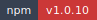
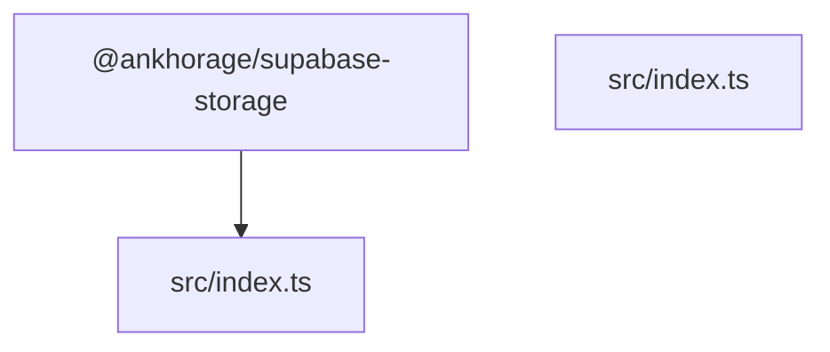

# @ankhorage/supabase-storage

        

Type-safe Supabase Storage adapter for uploads, public URLs, and asset metadata.

## Usage (standalone)

This package is framework-neutral and can be used in any TypeScript project.

```ts
import { createSupabaseStorageAdapter } from '@ankhorage/supabase-storage';

const storage = createSupabaseStorageAdapter({
  url: process.env.SUPABASE_URL ?? '',
  anonKey: process.env.SUPABASE_ANON_KEY ?? '',
  bucket: 'public',
});

const bytes = new Uint8Array([72, 101, 108, 108, 111]); // "Hello"

const upload = await storage.upload({
  path: 'examples/hello.txt',
  body: bytes,
  contentType: 'text/plain',
  upsert: true,
});

if (!upload.ok) {
  console.error(upload.error);
  process.exit(1);
}

const url = await storage.publicUrl({ path: 'examples/hello.txt' });
if (url.ok) {
  console.log(url.data.asset.publicUrl);
}
```

Browser note (conversion only; not part of the adapter API):

```ts
const bytes = new Uint8Array(await file.arrayBuffer());
```

## Generated documentation

- [Interactive documentation app](././paradox/index.html)
- [Public API reference](././paradox/exports.md)
- [Component registry](././paradox/components.md)
- [Architecture overview](././paradox/diagrams/architecture-overview.mmd)
- [Module relationships](././paradox/diagrams/module-relationships.mmd)
- [Export graph](././paradox/diagrams/export-graph.mmd)
- [Entrypoint sequence](././paradox/diagrams/entrypoint-sequence.mmd)

## Architecture preview



## Path resolution

- Config discovery: searches upward from `process.cwd()` for `paradox.config.ts/js/mjs/cjs` (required; no fallback).
- Package root: defaults to the directory containing `paradox.config.*`; `package.root` (when relative) resolves relative to that directory.
- Output directory: defaults to `paradox/`; `output.dir` (when relative) resolves relative to the resolved package root and must stay inside it.
- Modes:
  - `safe`: writes generated artifacts only under the output directory
  - `write`: additionally updates `<packageRoot>/README.md`
