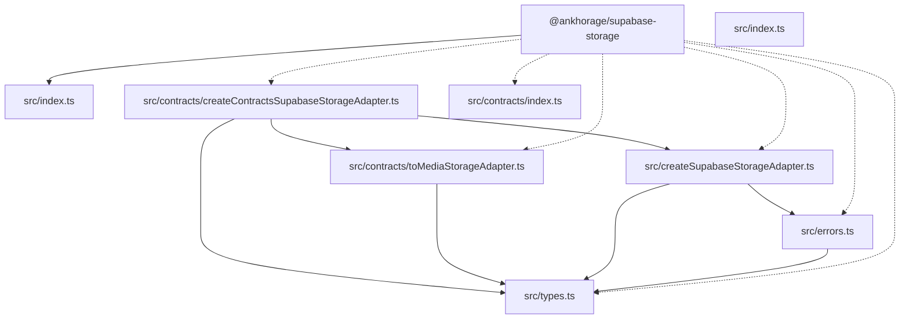

<!-- markdownlint-disable MD013 MD033 -->
<!-- This file is generated by Paradox. Do not edit manually. -->

# @ankhorage/supabase-storage

        

Type-safe Supabase Storage adapter for uploads, public URLs, and asset metadata.

## Generated documentation

- [Interactive documentation app](././paradox/index.html)
- [Public API reference](././paradox/exports.md)
- [Component registry](././paradox/components.md)
- [Architecture overview](././paradox/diagrams/architecture-overview.mmd)
- [Module relationships](././paradox/diagrams/module-relationships.mmd)
- [Export graph](././paradox/diagrams/export-graph.mmd)
- [createSupabaseStorageAdapter sequence](././paradox/diagrams/sequences/create-supabase-storage-adapter.mmd)

## Architecture preview

Architecture overview

```mermaid
graph TD
  package__ankhorage_supabase_storage["@ankhorage/supabase-storage"]
  entrypoint_src_index_ts["src/index.ts"]
  package__ankhorage_supabase_storage --> entrypoint_src_index_ts
  module_src_contracts_createContractsSupabaseStorageAdapter_ts["src/contracts/createContractsSupabaseStorageAdapter.ts"]
  package__ankhorage_supabase_storage -.-> module_src_contracts_createContractsSupabaseStorageAdapter_ts
  module_src_contracts_createContractsSupabaseStorageAdapter_ts --> module_src_contracts_toMediaStorageAdapter_ts
  module_src_contracts_createContractsSupabaseStorageAdapter_ts --> module_src_createSupabaseStorageAdapter_ts
  module_src_contracts_createContractsSupabaseStorageAdapter_ts --> module_src_types_ts
  module_src_contracts_index_ts["src/contracts/index.ts"]
  package__ankhorage_supabase_storage -.-> module_src_contracts_index_ts
  module_src_contracts_toMediaStorageAdapter_ts["src/contracts/toMediaStorageAdapter.ts"]
  package__ankhorage_supabase_storage -.-> module_src_contracts_toMediaStorageAdapter_ts
  module_src_contracts_toMediaStorageAdapter_ts --> module_src_types_ts
  module_src_createSupabaseStorageAdapter_ts["src/createSupabaseStorageAdapter.ts"]
  package__ankhorage_supabase_storage -.-> module_src_createSupabaseStorageAdapter_ts
  module_src_createSupabaseStorageAdapter_ts --> module_src_errors_ts
  module_src_createSupabaseStorageAdapter_ts --> module_src_types_ts
  module_src_errors_ts["src/errors.ts"]
  package__ankhorage_supabase_storage -.-> module_src_errors_ts
  module_src_errors_ts --> module_src_types_ts
  module_src_index_ts["src/index.ts"]
  module_src_types_ts["src/types.ts"]
  package__ankhorage_supabase_storage -.-> module_src_types_ts
```

